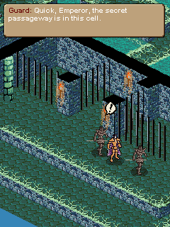
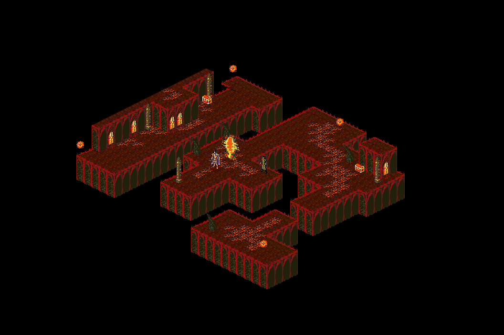

# OpenOBM

An experimental Rust reimplementation of the engine for *The Elder Scrolls
Travels: Oblivion* (2006, Java ME).

The inspected MIDlet credits Superscape in its vendor and build-system manifest
fields. Its in-game copyright notice names Vir2L Studios and Bethesda Softworks.

> **Development preview:** you can play using your own game archive and the
> bundled open fonts. No private text-mask file or emulator setup is required.
> A complete human playthrough is still pending; bugs and softlocks may remain.

<p align="center">
  
  <br>
  <em>The Imperial City Prison, captured from the development setup.</em>
</p>

## Status

The engine implements the game's parsers, rendering, menus, gameplay loop, and
save/load support. Development tests compared selected outputs with reference
captures from the original game. **A complete human playthrough is still
pending.** Untested paths may contain bugs or softlocks.

The original game archive, extracted resource pack, and captured reference
fixtures are not distributed. The demonstration screenshots depict original
game content; see [NOTICE.md](NOTICE.md).

## Build and test

Install Rust and Cargo, then run these commands from the repository root:

```sh
cargo test --workspace --locked
cargo clippy --workspace --all-targets --locked -- -D warnings
cargo fmt --all -- --check
cargo check --workspace --all-targets --features game/interactive,render/interactive --locked
```

These checks do not require game data or a display. CI uses Rust 1.97.0.
Tests requiring private reference captures are enabled separately with
`game/fixtures` and `eso-tools/fixtures`.

## Supplying local game data

Use your own legally obtained copy of the original `Oblivion.jar`. The extraction
scripts unpack its resources into `assets/`, excluding Java classes:

```sh
pwsh tools/extract-assets.ps1 path/to/Oblivion.jar   # Windows
sh tools/extract-assets.sh path/to/Oblivion.jar     # Linux/macOS; requires unzip
```

With those resources, the parser checks and map renderer can run:

```sh
cargo test -p eso-tools --features assets --locked
cargo run -p render --bin map-shot -- ./assets l01_1.jtm out.png
cargo run -p render --features interactive --bin map-view -- ./assets l01_1.jtm
```

Keep extracted resources, saves, and generated images local. `.gitignore`
excludes the usual data directories, but does not prevent files being copied
elsewhere or forcibly added.

### Play

After extracting your archive, run this from the repository root:

```sh
cargo run -p game --features interactive --bin play --release --locked
```

See [controls](docs/controls.md). Saves are stored locally in `playdata/eso.bin`.

Liberation Sans Regular and Bold are embedded in the program under the SIL Open
Font License. All three tools (`play`, `levelmap`, and `mapforge`) use these fonts
without downloads, system font installation, Java, or reference captures. Text
appearance and line wrapping can differ from the development screenshots.
See [font provenance and rendering](crates/game/fonts/README.md).

To check menus, dialogue, gameplay, and level loading with your extracted data
without opening a window:

```sh
cargo test -p game --features assets --test public_play --locked
```

Private pixel-comparison suites still load their explicit reference masks and
require the unpublished captures. Enable those separately with `game/fixtures`
and `eso-tools/fixtures`; they are not part of the player setup.

## Validation during development

The following summarizes recorded comparisons from development. These results
apply to the cases exercised; they do not establish correctness for every game
state and have not been independently reproduced from this public checkout.

| Area | Recorded coverage |
|---|---|
| Data formats | Maps, language tables, models, scripts, the 79-opcode decoder, stat tables, and saves |
| Game logic | 15 comparison sweeps covering progression, combat, movement, animation, effects, AI, and spellcasting |
| Shell | 70 pixel comparisons covering boot, menus, gameplay, shops, saves, death, and credits |
| Levels | Scripted cases across l01–l12 and the ending, including sequential loading |

The reference harness used a JVM transcription of loader algorithms and an
instrumented FreeJ2ME. That harness and its game-derived captures are not part of
this repository. The default public tests exercise synthetic, data-free cases.

## Project layout

| Directory | Purpose |
|---|---|
| `crates/formats` | Data parsers, VM formats, and shared game logic |
| `crates/eso-tools` | Format inspection and diagnostic commands |
| `crates/render` | Map and sprite rendering |
| `crates/game` | Menus, gameplay shell, save/load, and interactive frontend |
| `tests/drives` | Input sequences used for development comparisons |
| `tools` | Resource extraction and publication checks |

## Audio observations

The development notes report no audio assets or media API references in the
inspected game archive. Its manifest declares `MIDP-1.0`. OpenOBM currently has no
audio output. These observations apply to the inspected build.

## Experimental tools

`mapforge` generates custom maps, and `play wide` / `play wide10` provide wider
viewports. These experiments are outside the original viewport comparisons.

<details>
<summary>Level rendering example: Kvatch Oblivion Gate</summary>



Captured with `levelmap` in the development setup. The image depicts original
game content.

</details>

## Contributing and licensing

See [CONTRIBUTING.md](CONTRIBUTING.md) for local checks and publication safeguards.
OpenOBM was developed with assistance from Claude Code.

The engine source is dual-licensed **MIT OR Apache-2.0**. This is an unofficial
fan project, unaffiliated with ZeniMax Media, Bethesda Softworks, or Vir2L Studios.
Original game materials are not covered by the engine's license; see
[NOTICE.md](NOTICE.md).
